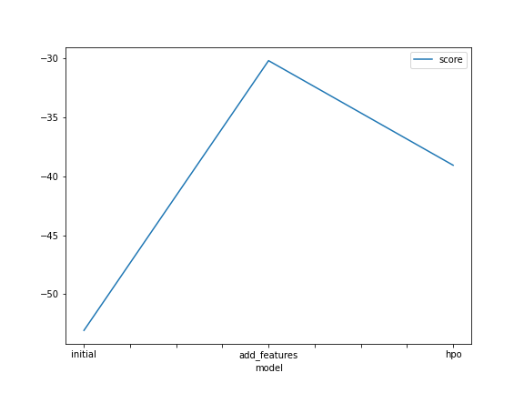
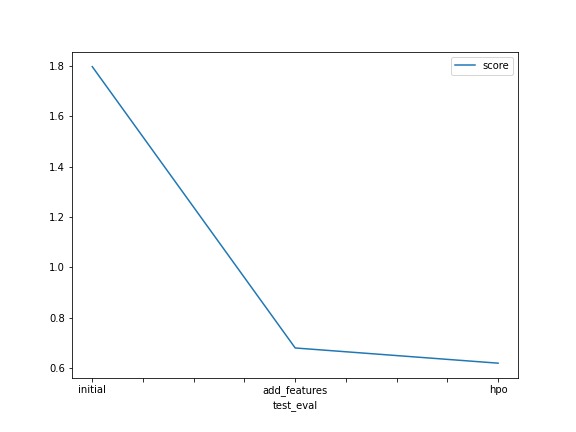

# Report: Predict Bike Sharing Demand with AutoGluon Solution
#### GAURAV GUPTA

## Initial Training
### What did you realize when you tried to submit your predictions? What changes were needed to the output of the predictor to submit your results?
Kaggle were not accepting the negative count as in real-life scenario negative count of bikes is not possible therefore, I had to set all the negative counts in the predicted list to zero (0).

### What was the top ranked model that performed?
After applying AutoGluon the top ranked model is found to be *WeightedEnsemble_L3*

## Exploratory data analysis and feature creation
### What did the exploratory analysis find and how did you add additional features?
I managed to derive from the distriutions that the temperature categories were normally distributed. The datetime needed to be split into more features and I chose to split it into year, month, day and hour which is what improve my model the most. About the season I suppose that we see the four seasons in the distribution and it is the same for the weather which has three categories of input. Workday and holiday are both binary fields and humidity and windspeed are both left skewed.

### How much better did your model preform after adding additional features and why do you think that is?
After splitting the datetime to year, month, day and hours top model score value almost increased by 45% at first.

## Hyper parameter tuning
### How much better did your model preform after trying different hyper parameters?
The model performed much better than the initial model but a little bit worse than the improvement with just the features. I followed the suggested hyperparameter improvement for tabular data provided by autogluon but did not manage to figure out how to additionally tune the parameters in order to improve the result. More background information is needed to fine-tune the model.

### If you were given more time with this dataset, where do you think you would spend more time?
I would try to figure out more ways to improve on the features as they seem to be the ones that lead to improvement of the score. Maybe some one-hot encoding or adjusting for the seasons or working hours will provide us with a better result or hyperparameter tuning.

### Create a table with the models you ran, the hyperparameters modified, and the kaggle score.
|model|timelimit|presets|search strategy|score|
|--|--|--|--|--|
|initial|600|best_quality|random|1.79|
|add_features|600|best_quality|random|0.67|
|hpo|2400|best_quality|bayesopt|0.61|

### Create a line plot showing the top model score for the three (or more) training runs during the project.

### Create a line plot showing the top kaggle score for the three (or more) prediction submissions during the project.

## Summary
The most benefit is received by working with the features and you can gain great insights from the EDA. Working forward my goal would be to improve the model by taking into consideration the working hours which impact the bike demand and the seasonal spikes and lows.
